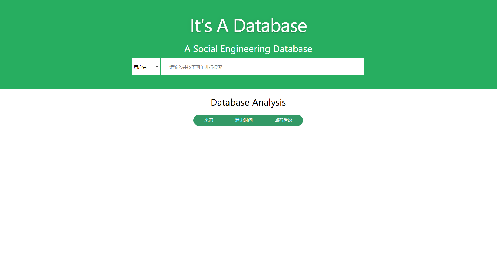
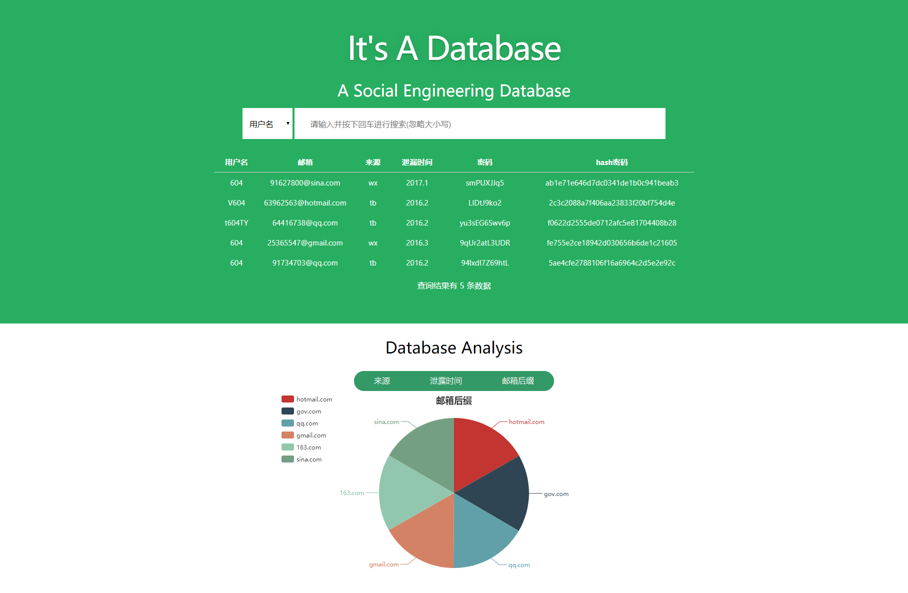

# Social Engineering Database

## Backend
- Using language: python 3.5
- Using database: MongoDB
- Requirements: pymongo, flask, Flask-RESTful

## Frontend
- Using vue.js
- Requirements: axios, echarts

## Frontend Preview

## Make it better
1. SQL query not safe enough.
2. Inefficient SQL query.
3. Backend interface limit.
4. Frontend search waiting layout.
